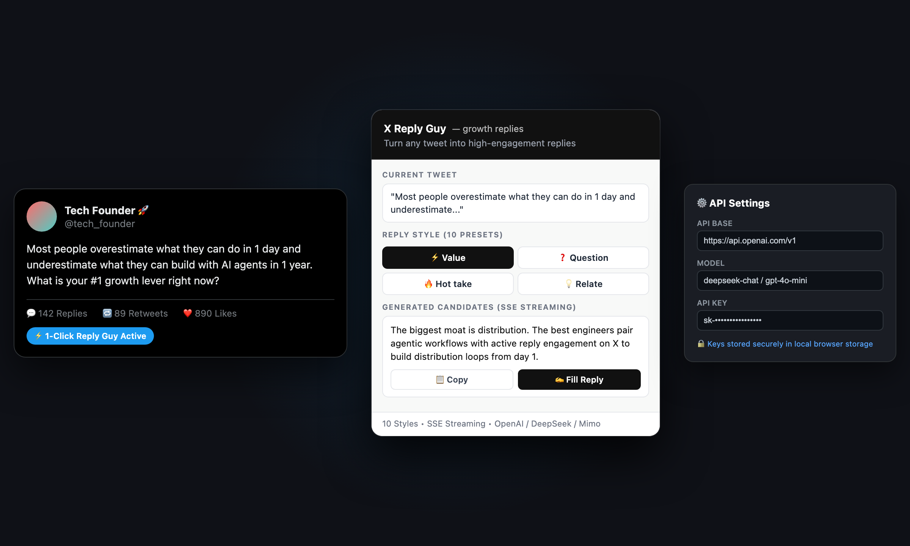

# ⚡ X Reply Guy

<p align="center">
  
</p>

<p align="center">
  
  
  
  
  
</p>

**Turn any tweet into high-engagement replies.**  
**X Reply Guy** is a modern Chromium browser extension (MV3) engineered to accelerate your organic growth on X (Twitter). By applying proven high-engagement "Reply Guy" strategies, the extension reads the context of any post on your timeline or detail page, generates targeted replies across 10 distinct tones via streaming LLMs, and lets you insert them into the composer with a single click.

---

## ✨ Features

- 🎯 **Automatic Tweet Context Extraction**: Instantly parses active tweets across your home timeline, single status views, and floating reply dialogs.
- 🎭 **10 Battle-Tested Reply Styles**:
  - `⚡ Value` — Adds insightful takeaways, industry frameworks, or actionable advice.
  - `❓ Question` — Hooks the author and readers with open-ended conversation starters.
  - `🔥 Hot take` — Sharp, contrarian viewpoints that ignite debate and virality.
  - `😄 Witty` — Humorous, punchy, and clever banter.
  - `💡 Relate` — Validates the author's point with personal resonance and empathy.
  - `📊 Data` — Supplies statistical backing, benchmark numbers, or logical proofs.
  - `📖 Story` — Short, impactful real-world anecdotes.
  - `🥊 Pushback` — Respectful yet firm counter-arguments.
  - `🙏 Devout` — Highly supportive, community-building enthusiasm.
  - `🤝 Sincere` — Authentic, grounded, and human encouragement.
- ⚡ **Low-Latency SSE Streaming**: Renders reply candidates in real time with Server-Sent Events (SSE). Full compatibility with both reasoning models (e.g. `hy3`, `flash v4`) and low-latency chat models.
- ✍️ **1-Click Copy & Direct Fill**:
  - **Copy**: Places the generated response directly on your clipboard.
  - **Fill**: Programmatically injects the chosen reply into X's active draft box and enables the native `Reply` button immediately.
- 🌐 **Universal LLM Endpoint Compatibility**: Seamlessly works with OpenAI, DeepSeek, Mimo, OpenCode Zen, Ollama, Groq, or any standard OpenAI-compatible API base URL.
- 🖱️ **Context Menu Shortcut**: Select any text on any page → Right click → *Reply to selection with Reply Guy*.
- 🔒 **Zero Telemetry & Local Security**: Your API keys are stored strictly inside your browser's local `chrome.storage.sync` and are never transmitted to third parties.

---

## 🎬 Step-by-Step Interactive Guide

<p align="center">
  
</p>

| Step | Action | Description |
| :---: | :--- | :--- |
| **01** | **Locate Post on X** | Browse your timeline or post detail page. Reply Guy automatically detects the focused tweet. |
| **02** | **Trigger & Auto-Parse** | Click the **⚡ Reply Guy** icon in your toolbar or the inline tweet widget. The tweet context is parsed in milliseconds. |
| **03** | **Choose Reply Persona** | Pick from 10 battle-tested growth tones (`⚡ Value`, `🔥 Hot take`, `😄 Witty`, `❓ Question`, etc.). |
| **04** | **Fast SSE Streaming** | Your configured LLM streams 3 curated candidate replies in real-time. |
| **05** | **1-Click Fill & Publish** | Click **✍️ Fill** to inject the chosen reply straight into X's active draft box — the native `Reply` button lights up instantly with zero typing! |

---

## 📸 Workflow Architecture

```
Browse X (Twitter)
      │
      ▼
Open Post / Click Reply
      │
      ▼
Automatic Tweet Parsing (content.js / popup.js)
      │
      ▼
Choose Reply Preset (10 Options)
      │
      ▼
Fast SSE Streaming Generation via LLM (background.js)
      │
      ▼
3 Curated Candidate Replies
      │
      ├─ [📋 Copy] ──► Clipboard
      └─ [✍️ Fill] ───► Injects directly into X's active composer + enables Reply
```

---

## 🚀 Installation

Works on **Google Chrome**, **Brave**, **Comet**, **Microsoft Edge**, **Arc**, and any Chromium browser:

1. Clone or download this repository:
   ```sh
   git clone https://github.com/pepedesigner/X-Reply-Guy.git
   ```
2. Navigate to your browser's extensions page (`chrome://extensions` or `brave://extensions`).
3. Toggle on **Developer mode** in the top right corner.
4. Click **Load unpacked** (加载已解压的扩展程序) and select the `x-reply-guy` project directory.
5. Pin the extension to your toolbar.
6. Click the extension icon → **Options** to configure your API endpoint.

---

## ⚙️ Configuration & Recommended Models

Open the **Options** page (`chrome-extension://<id>/options.html`) to configure:

| Field | Description | Example |
| :--- | :--- | :--- |
| **API Base** | Any OpenAI-compatible base URL | `https://api.openai.com/v1` or `https://api.deepseek.com/v1` |
| **API Key** | Your provider API key | `sk-••••••••••••••••` |
| **Model** | Target model name | `deepseek-chat`, `gpt-4o-mini`, `mimo-v2.5` |

### Recommended Models by Use Case

| Priority | Recommended Model | Strengths |
| :--- | :--- | :--- |
| 🚀 **Fastest Growth / Chinese Posts** | `deepseek-chat` / `mimo-v2.5` | Instant time-to-first-token, natural vernacular tone |
| 🌎 **Global & English Content** | `gpt-4o-mini` | Strong English nuance, concise formatting |
| 🧠 **Deep Logical Depth** | `hy3` / `gemini-2.0-flash` / reasoning models | Rich contextual comprehension and storytelling |

---

## 📂 Project Structure

```
x-reply-guy/
├── manifest.json          # Chrome Extension Manifest V3
├── background.js          # Service worker: LLM SSE streaming & context menus
├── content.js             # DOM extractor & reply composer injector
├── content.css            # Floating widgets & styling
├── popup.html             # Main popup interface
├── popup.js               # Extension popup logic & candidate cards
├── options.html           # Settings UI
├── options.js             # Options persistence via chrome.storage
├── icon.png               # Extension icon
├── remotion-guide/        # Remotion video generation workspace & components
└── screenshots/           # UI preview screenshots & animated GIF/MP4 guide
```

---

## 🛡️ Privacy & Safety

- **No Intermediate Servers**: Direct network connections between your browser and your configured LLM API.
- **Local Storage Only**: Keys remain strictly within your browser profile.
- **Minimal Permissions**: Scoped only to `x.com` / `twitter.com` tabs and active storage.

---

## 📄 License

MIT License © [pepedesigner](https://github.com/pepedesigner)
